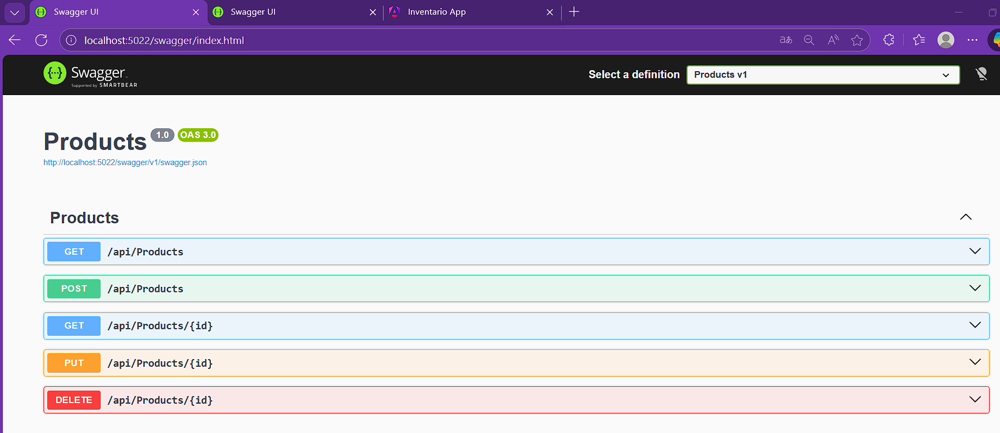
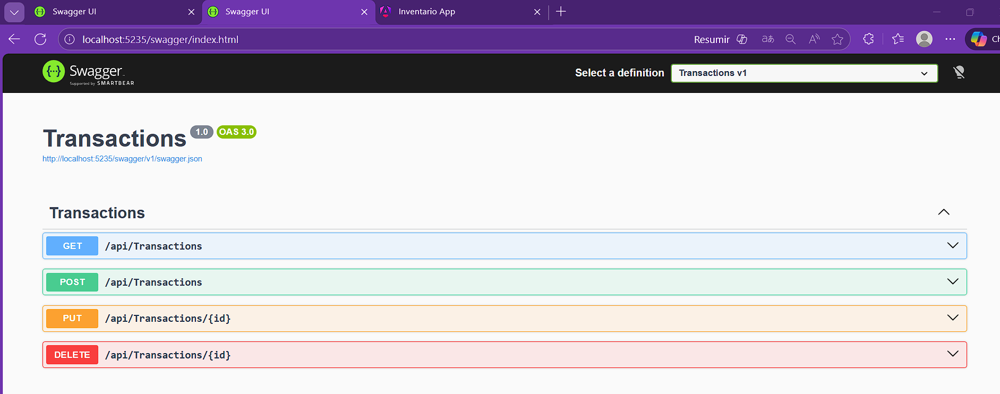
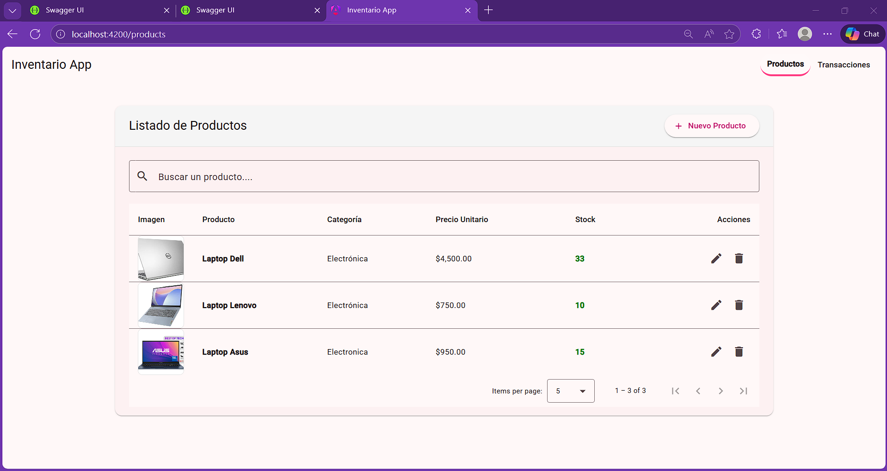
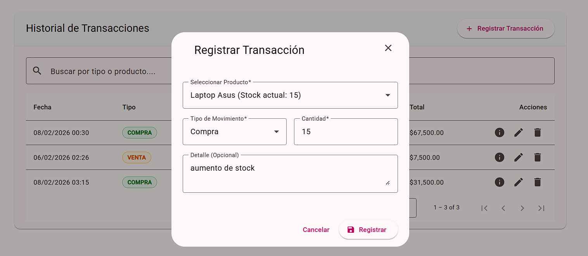
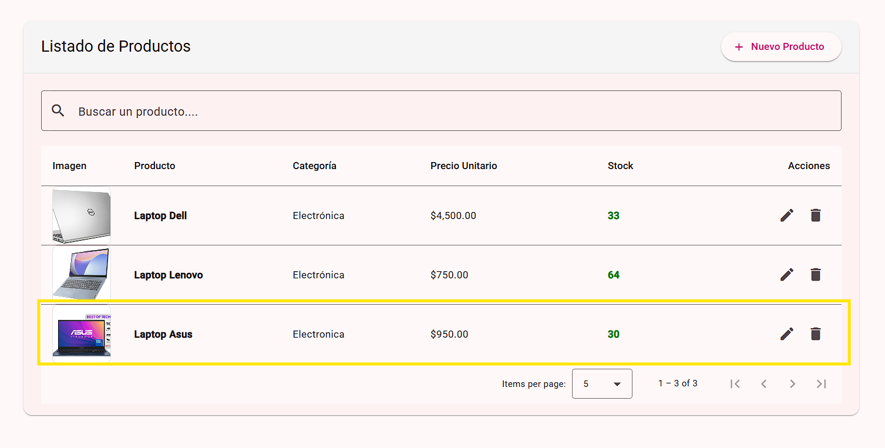
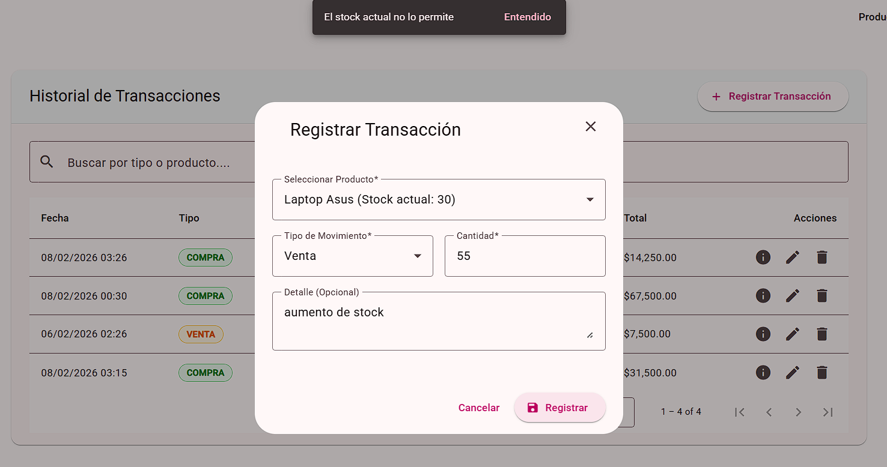
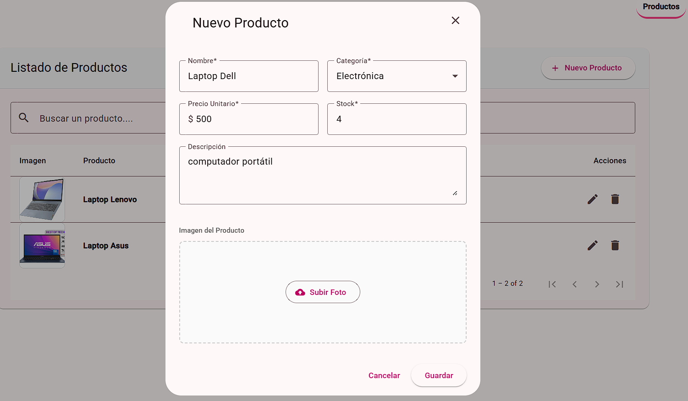

# Sistema de Gestión de Inventario (Microservicios)

Este proyecto es una solución integral para el control de stock, compras y ventas. Utiliza una arquitectura de Microservicios con .NET 10 en el backend y una interfaz moderna en Angular 21 con Material Design.

## 🚀 Arquitectura

El sistema aplica una separación de responsabilidades mediante servicios independientes:
1.  **Products Microservice (Puerto 5022):** Gestiona el catálogo maestro de productos, incluyendo la persistencia de imágenes en Base64 y el control de existencias.
2.  **Transactions Microservice (Puerto 5235):**  Registra movimientos de inventario. Este servicio utiliza una **comunicación síncrona vía HTTP** para validar y actualizar el stock en el Microservicio de Productos en tiempo real.

## 📋 Requisitos Previos

Para ejecutar este proyecto necesitas:

* .NET 10 SDK
* Node.js (v20 o superior) y Angular CLI
* SQL Server (Local o Remoto)
* Editor de código (Visual Studio Code)

## ⚙️ Configuración de la Base de Datos

### 1. Crear la Base de Datos
En la raíz del proyecto encontrarás una carpeta `DataBase` con el script `script_db.sql` **Ejecuta este script en tu servidor SQL** para crear la base de datos `InventoryDB` y las tablas necesarias.


### 2. Configurar la Cadena de Conexión (Importante)
Cada microservicio se conecta a la base de datos de manera independiente. Debes configurar tu servidor local en **ambos** proyectos.

1.  Navega a `backend/Products/appsettings.json`
2.  Navega a `backend/Transactions/appsettings.json`

En **ambos archivos**, localiza la sección `ConnectionStrings` y modifica los valores de `Server`, `User Id` y `Password` según tu configuración local:

```json
"ConnectionStrings": {
  "DefaultConnection": "Server=TU_SERVIDOR_SQL; Database=WorkManagementDB; User Id=TU_USUARIO; Password=TU_PASSWORD; TrustServerCertificate=True;"
}
```
## 🛠️ Ejecución del Proyecto
Para levantar el sistema, debe abrir tres terminales y ejecutar cada microservicio por separado y al final la App de Angular:
### 1.   Iniciar Microservicio (Products)
En la primera terminal, ejecute:

```json
cd backend/Products
dotnet run 
```
#### Swagger UI: Una vez iniciado, acceda a la documentación en: http://localhost:5022/swagger/index.html


### 2. Iniciar Microservicio de (Transactions)
En la segunda terminal, ejecute:
```json
cd backend/Transactions
dotnet run
```
#### Swagger UI: Una vez iniciado, acceda a la documentación en: http://localhost:5235/swagger/index.html


### 3. Iniciar App de Angular
En la tercera terminal, ejecute:
```json
cd frontend/
npm install  (esperamos que se realice la instalacion completa del node Modules)
ng serve
```
#### UI App: Una vez iniciado, acceda a la ruta en el navegador: http://localhost:4200/products



## ✅ Verificación de Resultados
#### Prueba 1: Registro de Compra (Incremento de Stock)
**Acción:** Ve a la pestaña Transacciones, selecciona un producto y elige el tipo "Compra". Registra 50 unidades.



**Resultado Esperado:** El microservicio de transacciones notificará al de productos. Al volver a la pestaña Productos, verás que el stock aumentó automáticamente. 



#### Prueba 2: Validación de Venta (Modo "No Negativo")
**Acción:** Intenta realizar una "Venta" por una cantidad mayor al stock actual del producto.
**Resultado Esperado:** El sistema lanzará una excepción. El frontend capturará el error y mostrará un mensaje elegante: "El stock actual no lo permite".  



#### Prueba 3: Gestión Multimedia
**Acción:** En el formulario de Producto, utiliza el botón "Subir Foto" para cargar una imagen desde tu PC.  
**Resultado Esperado:** El sistema convertirá la imagen a Base64. Podrás ver la vista previa antes de guardar y la miniatura de alta calidad en la tabla principal.

  


